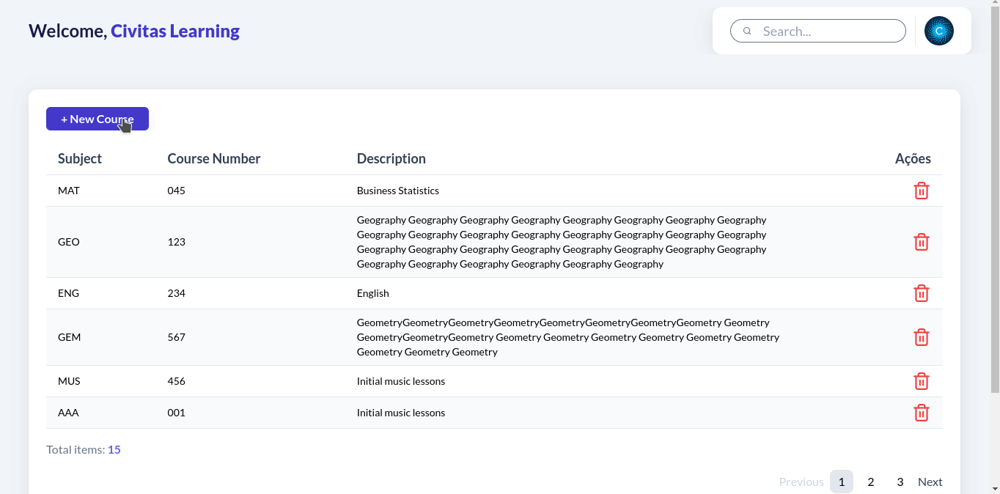

<h1 align="center">CIVITAS - WEB</h1>

## About this Project

This application allows users to manage course records. Built with a focus on simplicity, it has functionalities to add, search, and delete courses.
The application handles course details such as subject, course number (formatted as three-digit, zero-padded integer), and description. And it prevents the addition of duplicate courses and validates course numbers.

## Project presentation



## Functionalities

- Primary

  - Search: Find courses by partial descriptions (e.g., "Bio" finds "Introduction to Biology").
  - Add/Delete: Easily add new courses or delete existing ones.
  - Validation: Ensures course number formatting and unique course entries.

- Secondary

  - When listing courses, the application could include pagination functionality to improve navigation of longer course lists.
  - Unit tests of application routes.

## Used Techs

- Axios: Popular JavaScript library used to make HTTP requests from the browser or Node.js.
- Lucide-react: A React-based icon library that provides a modern, open-source alternative to the Feather icons set.
- Tailwind: Is a utility-first CSS framework designed to build modern, responsive websites without writing custom CSS.
- Yup: A JavaScript schema builder for value parsing and validation.
- Vitejs: A fast and modern build tool for web development, focusing on performance and simplicity.

# How to run the project

> Node version used: v20.9.0

> NPM version used: v10.1.0

## Application

````bash
# (1) Install project dependencies
npm install

```bash
# (2) Run the application on localhost -> http://localhost:5173
npm run dev
````

# Author

Made with 💚 by Guilherme Bafica 👋

[](https://www.linkedin.com/in/guilhermebafica/)
